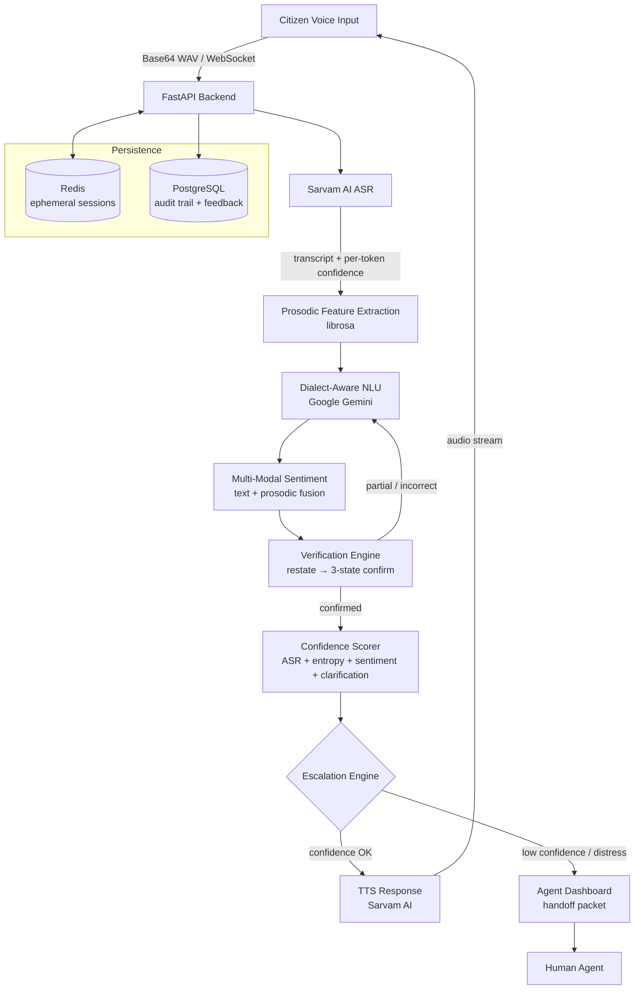
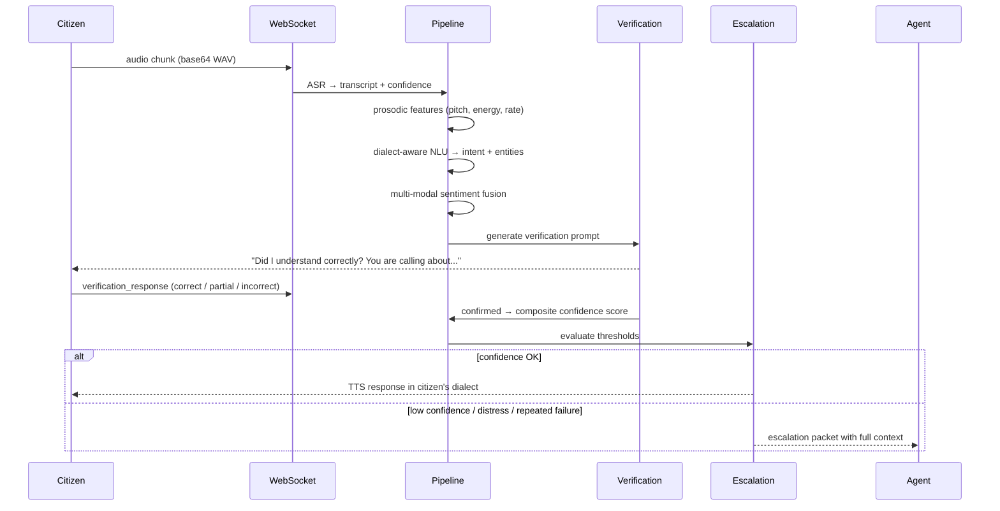
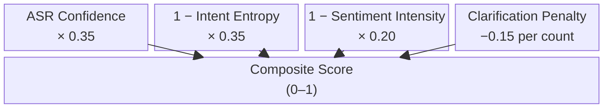

# Samvaad-Setu

**Multilingual Voice Assistant for Karnataka's 1092 Citizen Helpline**

---

## The Problem

Karnataka's 1092 helpline serves millions of citizens across 31 districts — speaking Kannada, Hindi, English, and a dozen regional dialects. When a distressed Mangaluru resident calls about a water supply failure, three things have to happen correctly and quickly: the system must *hear* them accurately, *understand* what they mean (not just what they said), and *confirm* it before taking any action.

Today, that handoff fails constantly. Dialect mismatches produce wrong intents. Low ASR confidence goes undetected. Agents receive escalation packets with no context. There is no audit trail, no feedback loop, and no way to tell if the system actually helped.

Samvaad-Setu is a real-time voice pipeline designed around a single constraint: **correct understanding before action.** Every component — the verification loop, the confidence scorer, the dialect-aware NLU — exists to enforce that constraint.

---

## Architecture



---

## Voice Pipeline — Per Turn



---

## Features

### Dialect-Aware Understanding

The system maps each of Karnataka's districts to a dialect profile, injecting vocabulary hints, formality register, and code-mixing patterns into the Gemini prompt before any NLU call is made.

**9 district profiles covered:** Bengaluru Urban, Bengaluru Rural, Mysuru, Mangaluru (Tulu coast), Udupi, Hubballi-Dharwad, Belagavi, Kalaburagi, Vijayapura — each with 20–40 dialect terms, regional greetings, and observed code-mixing patterns (English, Hindi, Urdu).

Verification prompts are rendered in the citizen's dialect register, not generic Kannada — so a Mangaluru caller hears *"Yenu helti, naanu sariyaagi tagonde?"* rather than a Bengaluru-tuned phrasing.

### Verification Loop

After every turn, the system restates the citizen's issue back to them before committing to any intent. The citizen can respond with three states:

- **Correct** — confirmation recorded; pipeline proceeds
- **Partial** — clarification count increments; targeted follow-up question generated
- **Incorrect** — if fewer than 2 clarifications attempted, re-asks; otherwise escalates with reason `repeated_clarification`

This loop is the primary defense against wrong intent extraction. It runs before any escalation or final response decision.

### Composite Confidence Scoring



- **< 0.6** → trigger clarification
- **< 0.4** → escalate with reason `low_confidence`
- Sentiment label `distress / fear / anger` + intensity > 0.7 → escalate with reason `high_distress`
- Clarification count ≥ 2 → escalate with reason `repeated_clarification`

### Multi-Modal Sentiment

Text-based sentiment from Gemini is fused with prosodic signals extracted by librosa (pitch variance, energy, speaking rate). A caller who uses calm words but exhibits elevated vocal stress will produce a higher distress score than text alone would suggest.

Fusion weights: text 0.6, prosodic 0.4. Output includes per-component breakdown and a rolling timeline of the last 20 turns.

### Karnataka Grievance Taxonomy

30+ intent categories derived from Sevasindhu and Janasevaka — labeled in Kannada, Hindi, and English. Each category carries an escalation priority (1 = emergency, 5 = routine) and a responsible department mapping.

The Gemini NLU prompt is constrained to return only valid taxonomy IDs. Any out-of-taxonomy response triggers a human review flag.

Always-escalate categories: `distress_emergency`, `women_safety`, `hospital_complaint`, `food_adulteration`.

### PII Redaction

Before any text reaches Gemini, names, phone numbers, Aadhaar sequences, and addresses are replaced with tokens (`CITIZEN_NAME_N`, `PHONE_N`, `AADHAAR_N`, `ADDRESS_N`). Token maps are maintained in-memory; PII never appears in audit logs or training exports.

Controlled by `PII_REDACTION_ENABLED` in `.env`. Disabled automatically in mock mode.

### Agent Dashboard

When a call escalates, the agent receives a structured handoff packet:

- Full conversation transcript
- Sentiment timeline (rolling chart)
- Confidence history per turn
- Structured intent + dialect tag
- Audit log summary

Agents can correct misclassified intents directly from the dashboard. Corrections propagate to the feedback loop and are marked in the audit trail with actor and timestamp.

### Feedback Loop + Audit Trail

Every confirmed interaction writes a row to `verified_interactions` in PostgreSQL. Agent corrections update the `final_intent` field. The full corpus is exportable as JSONL for retraining.

Every state transition — session creation, verification confirmation, escalation, agent correction — is appended to `audit_log` with an immutable timestamp and actor field.

---

## Tech Stack

| Layer | Technology | Why |
|---|---|---|
| Frontend | Flutter Web | Single codebase for citizen view + agent dashboard; mobile-ready |
| Backend | FastAPI | Async-native, WebSocket-first, fast iteration |
| ASR / TTS | Sarvam AI | Best-in-class Kannada/Hindi/English with dialect coverage |
| NLU | Google Gemini | Strong multilingual reasoning; cheap; constrained-output via taxonomy |
| Prosody | librosa | Lightweight pitch/energy/rate extraction; no GPU required |
| Session state | Redis | Sub-ms reads; ephemeral and sticky-session friendly |
| Audit + feedback | PostgreSQL | Durable, SQL-queryable for compliance and retraining |

---

## Running the Project

### Docker (recommended)

```bash
docker compose up
```

Backend on `:8000`, frontend on `:8081`, Redis and Postgres wired automatically.

### Manual

```bash
# Backend
cd backend
python3 -m venv venv && source venv/bin/activate
pip install -r requirements.txt
cp .env.example .env          # add API keys or set ENVIRONMENT=mock
alembic upgrade head
uvicorn main:app --host 0.0.0.0 --port 8000 --reload

# Frontend (separate terminal)
cd app_frontend
flutter pub get
flutter run -d chrome --web-port 8081
```

Citizen view at `http://localhost:8081/`, agent dashboard at `http://localhost:8081/agent`.

### Mock Mode

Set `ENVIRONMENT=mock` in `backend/.env` to run without API keys. All AI services return realistic fake data with simulated latency — useful for UI testing and demos.

---

## Environment Variables

| Variable | Default | Description |
|---|---|---|
| `ENVIRONMENT` | `production` | Set `mock` to skip real API calls |
| `SARVAM_API_KEY` | — | Sarvam AI (ASR + TTS) |
| `GEMINI_API_KEY` | — | Google AI Studio (NLU) |
| `REDIS_URL` | `redis://localhost:6379` | Session store |
| `POSTGRES_URL` | `postgresql://localhost:5432/samvaad_setu` | Audit + feedback DB |
| `CORS_ORIGINS` | `["http://localhost:8081"]` | JSON array — required for pydantic-settings |
| `PII_REDACTION_ENABLED` | `true` | Mask PII before LLM calls |
| `ENABLE_PROSODY` | `true` | Librosa feature extraction; falls back to neutral if `false` |
| `AUDIO_RETENTION_HOURS` | `0` | Audio not persisted by default |
| `LATENCY_LOGGING` | `true` | Per-stage timing logs |

---

## API Endpoints

```
GET  /health                              backend + Redis + Postgres status
GET  /health/latency                      rolling p50/p95 per pipeline stage
POST /sessions?district=...&language=...  create session (idempotent via Idempotency-Key)
WS   /ws/{session_id}                     voice pipeline

GET  /agent/queue                         escalations by priority
GET  /sessions/{id}/escalation-packet     full handoff context
POST /sessions/{id}/agent-correction      write agent edit → feedback loop
GET  /audit/{session_id}                  full audit trail

GET  /training-data/export?format=jsonl   export verified interactions
GET  /docs                                Swagger UI
```

---

## Latency Budget

Target end-to-end: **< 1.5 s**

| Stage | Budget |
|---|---|
| ASR (streaming) | 300 ms |
| Prosodic features | 50 ms |
| NLU (Gemini) | 500 ms |
| Sentiment fusion | 30 ms |
| Verification logic | 20 ms |
| TTS (streaming) | 400 ms |
| WebSocket overhead | 100 ms |

Per-stage actuals available at `/health/latency`.

---

## Project Structure

```
samvaad-setu/
├── backend/
│   ├── main.py                          FastAPI app + WebSocket pipeline
│   ├── config.py                        Pydantic settings
│   ├── services/
│   │   ├── asr.py                       Sarvam AI ASR
│   │   ├── tts.py                       Sarvam AI TTS + local fallback
│   │   ├── nlu.py                       Gemini NLU with dialect + taxonomy injection
│   │   ├── prosody.py                   librosa pitch / energy / rate
│   │   ├── sentiment.py                 Text + prosodic fusion
│   │   ├── dialect_context.py           District → dialect profile mapping
│   │   ├── verification_engine.py       Restate → 3-state confirmation loop
│   │   ├── confidence_scorer.py         Composite score calculation
│   │   ├── intent_taxonomy.py           Karnataka grievance taxonomy
│   │   ├── escalation.py                Escalation rules engine
│   │   ├── audit_log.py                 PostgreSQL audit writes
│   │   ├── feedback_loop.py             Verified interactions + JSONL export
│   │   ├── pii_redactor.py              PII masking before LLM calls
│   │   └── session_manager.py           Redis session CRUD
│   ├── models/
│   │   ├── session_model.py             Session state, turns, confidence
│   │   └── audit_model.py               SQLAlchemy: AuditLog, VerifiedInteraction
│   ├── data/
│   │   ├── dialect_profiles.json        9 district profiles
│   │   ├── karnataka_grievance_taxonomy.json  30+ intent categories
│   │   └── verification_phrasings.json  Dialect-conditioned rephrasings
│   ├── migrations/                      Alembic migrations
│   └── tests/                           Unit tests for all services
│
├── app_frontend/
│   ├── lib/
│   │   ├── screens/
│   │   │   ├── citizen_view.dart        Voice call interface
│   │   │   └── agent_dashboard.dart     Live queue + corrections
│   │   ├── widgets/
│   │   │   ├── confidence_gauge.dart    Real-time confidence visualization
│   │   │   └── sentiment_timeline.dart  Rolling sentiment chart
│   │   └── services/
│   │       └── voice_pipeline_service.dart  WebSocket client
│   └── pubspec.yaml
│
├── docker-compose.yml
├── CLAUDE.md                            Architecture + implementation reference
└── DEMO.md                              Demo walkthrough
```

---

*Built for Karnataka's citizens — multilingual, dialect-aware, distress-sensitive.*